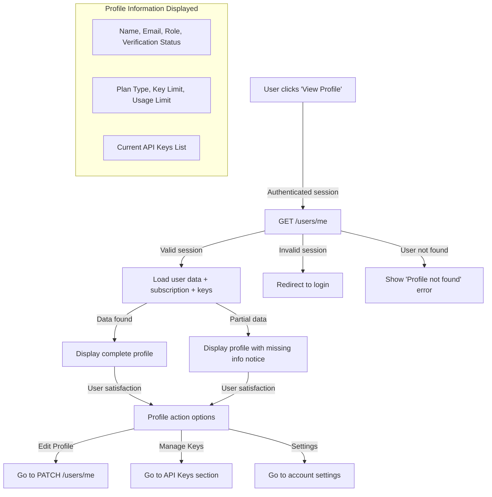
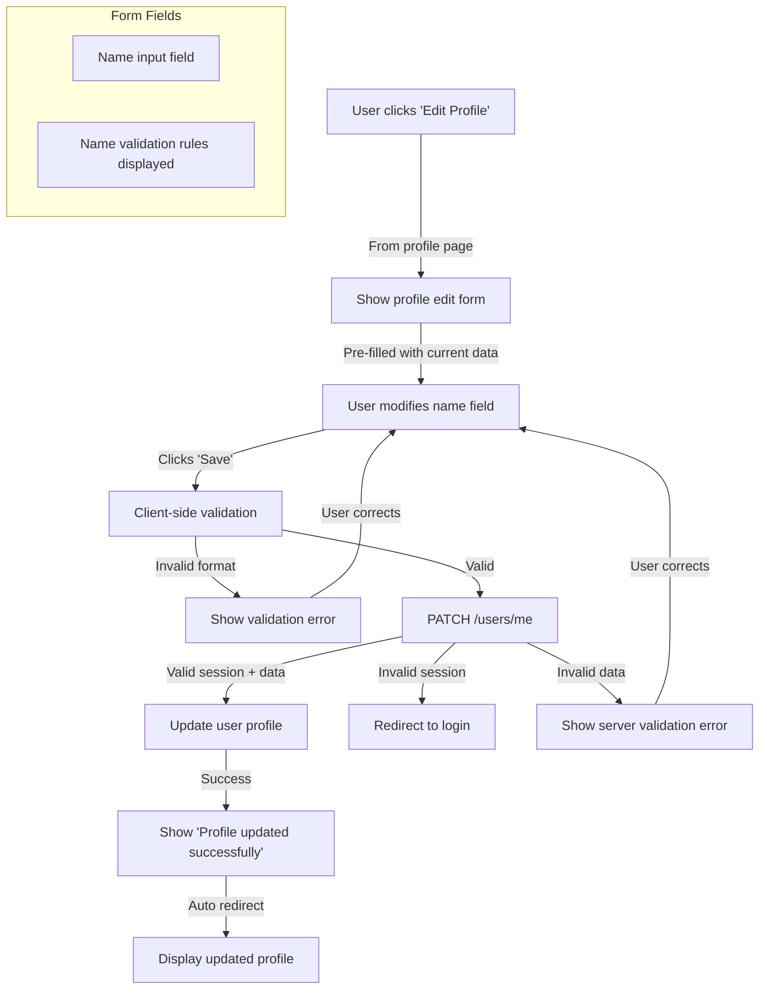
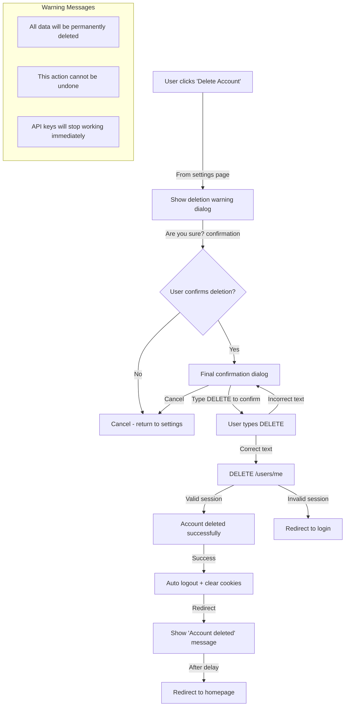
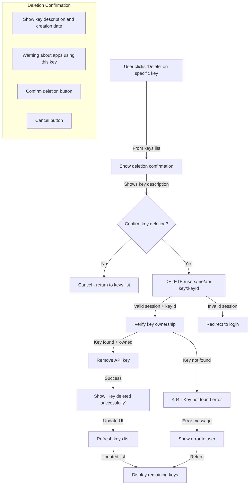
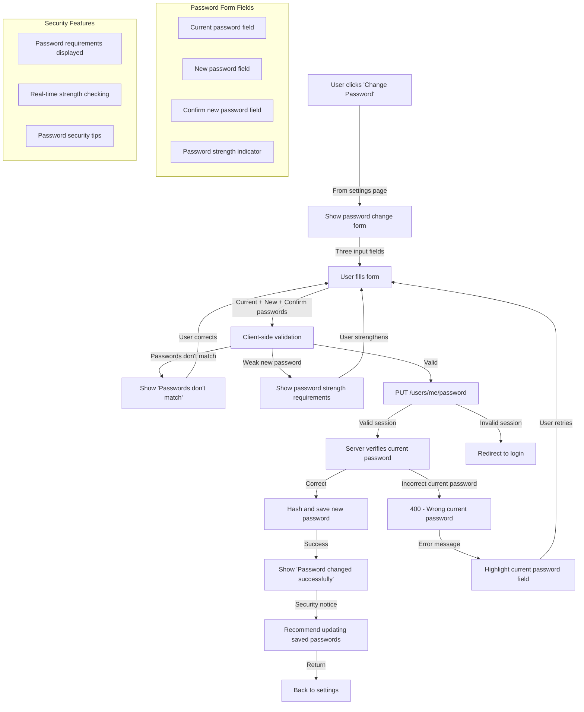
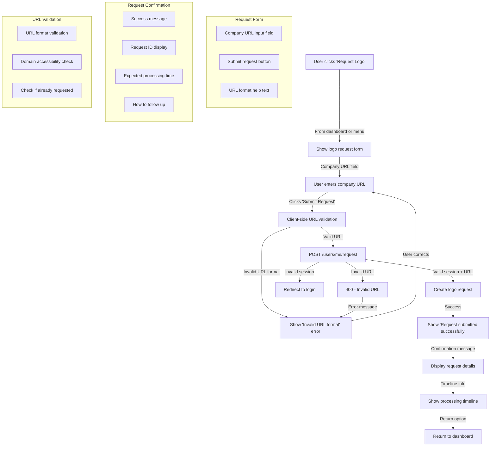
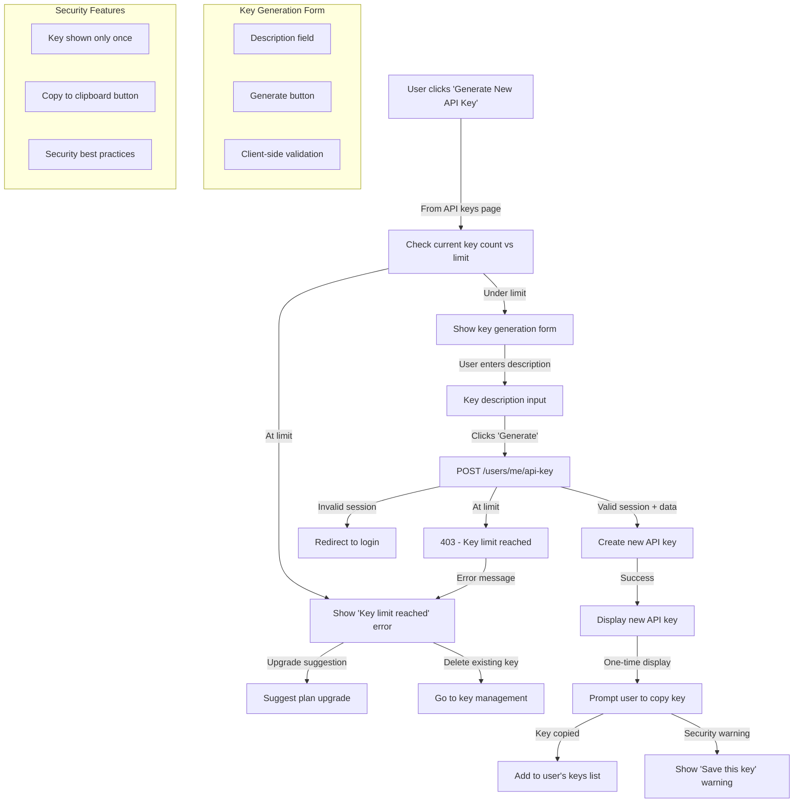

# GET /users/me - View Profile 

# PATCH /users/me - Update Profile

# DELETE /users/me - Delete Account

# DELETE /users/me/api-key/:keyId - Revoke API Key

# PUT /users/me/password - Change Password

# POST /users/me/request - Submit Logo Request

# POST /users/me/api-key - Generate API Key

