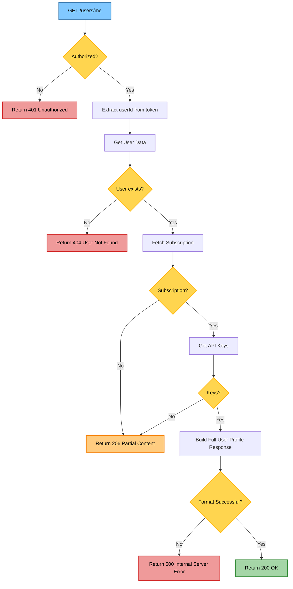
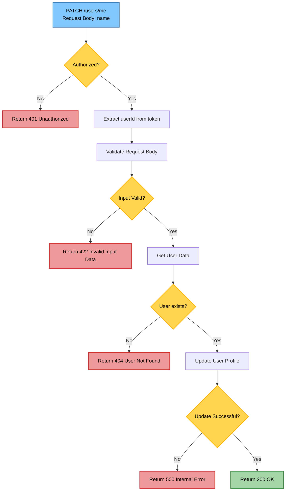

# GET /users/me - View Profile 


```mermaid
 flowchart TD
%% API Flow: GET /users/me
Start[GET /users/me] --> Auth{Authorized?}

Auth -->|No| Auth401[Return 401 Unauthorized]
Auth -->|Yes| ExtractUserId[Extract userId from token]

ExtractUserId --> GetUser[Get User Data]
GetUser --> UserExists{User exists?}

UserExists -->|No| User404[Return 404 User Not Found]
UserExists -->|Yes| GetSubscription[Fetch Subscription]

GetSubscription --> SubExists{Subscription?}
SubExists -->|No| Partial206[Return 206 Partial Content]
SubExists -->|Yes| GetKeys[Get API Keys]

GetKeys --> KeysFound{Keys?}
KeysFound -->|No| Partial206
KeysFound -->|Yes| FormatData[Build Full User Profile Response]

FormatData --> FormatSuccess{Format Successful?}
FormatSuccess -->|No| FormatError500[Return 500 Internal Server Error]
FormatSuccess -->|Yes| Success200[Return 200 OK]

classDef startEnd fill:#81C8FF,stroke:#4682B4,stroke-width:2px,color:#000;
classDef decision fill:#FFD54F,stroke:#FFB300,stroke-width:2px,color:#000;
classDef success fill:#A5D6A7,stroke:#388E3C,stroke-width:2px,color:#000;
classDef error fill:#EF9A9A,stroke:#D32F2F,stroke-width:2px,color:#000;
classDef warning fill:#FFCC80,stroke:#F57C00,stroke-width:2px,color:#000;

class Start,Success200 startEnd
class Auth,UserExists,SubExists,KeysFound,FormatSuccess decision
class Success200 success
class Auth401,User404,FormatError500 error
class Partial206 warning

``` 
#  PATCH /users/me - Update Profile

```mermaid
flowchart TD
%% API Flow: PATCH /users/me
Start[PATCH /users/me<br/>Request Body: name] --> Auth{Authorized?}

Auth -->|No| Auth401[Return 401 Unauthorized]
Auth -->|Yes| ExtractUserId[Extract userId from token]

ExtractUserId --> ValidateInput[Validate Request Body]
ValidateInput --> InputValid{Input Valid?}

InputValid -->|No| Input422[Return 422 Invalid Input Data]
InputValid -->|Yes| GetUser[Get User Data]

GetUser --> UserExists{User exists?}

UserExists -->|No| User404[Return 404 User Not Found]
UserExists -->|Yes| UpdateUser[Update User Profile]

UpdateUser --> UpdateSuccess{Update Successful?}
UpdateSuccess -->|No| Server500[Return 500 Internal Error]
UpdateSuccess -->|Yes| Success200[Return 200 OK]

classDef startEnd fill:#81C8FF,stroke:#4682B4,stroke-width:2px,color:#000;
classDef decision fill:#FFD54F,stroke:#FFB300,stroke-width:2px,color:#000;
classDef success fill:#A5D6A7,stroke:#388E3C,stroke-width:2px,color:#000;
classDef error fill:#EF9A9A,stroke:#D32F2F,stroke-width:2px,color:#000;
classDef warning fill:#FFCC80,stroke:#F57C00,stroke-width:2px,color:#000;

class Start,Success200 startEnd
class Auth,InputValid,UserExists,UpdateSuccess decision
class Success200 success
class Auth401,Input422,User404,Server500 error

```


 ```mermaid
```
