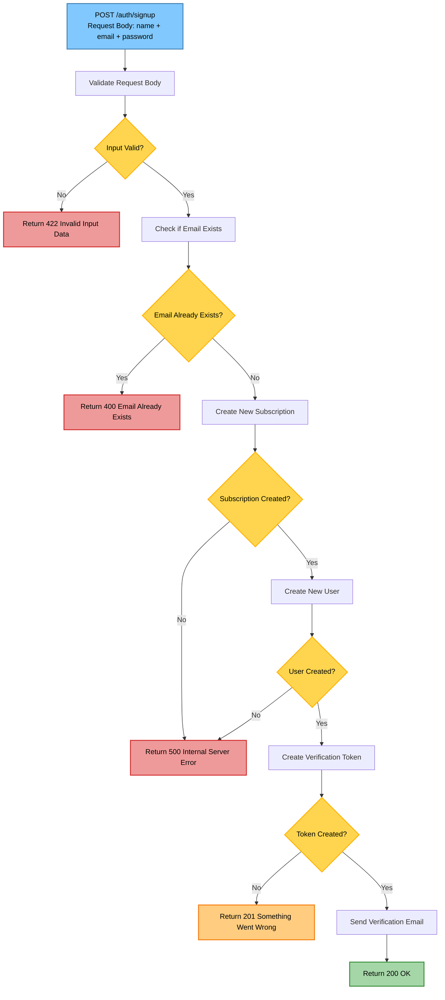
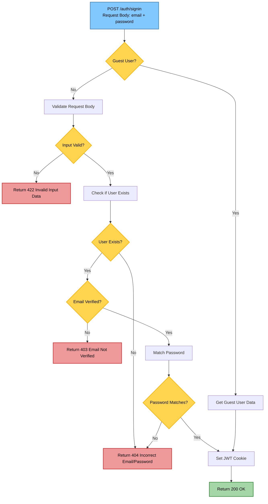
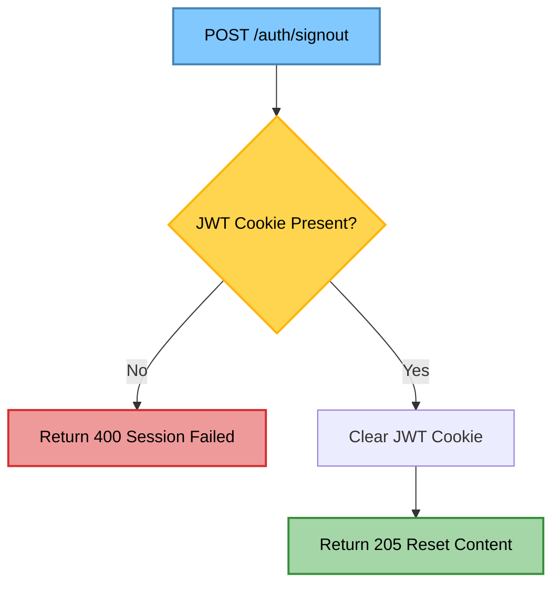
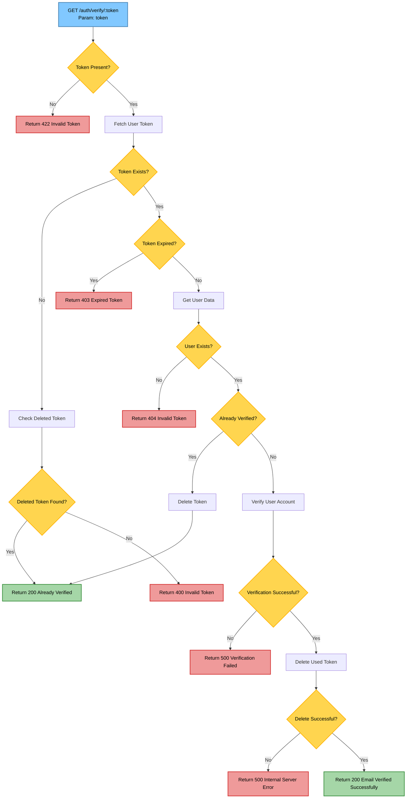
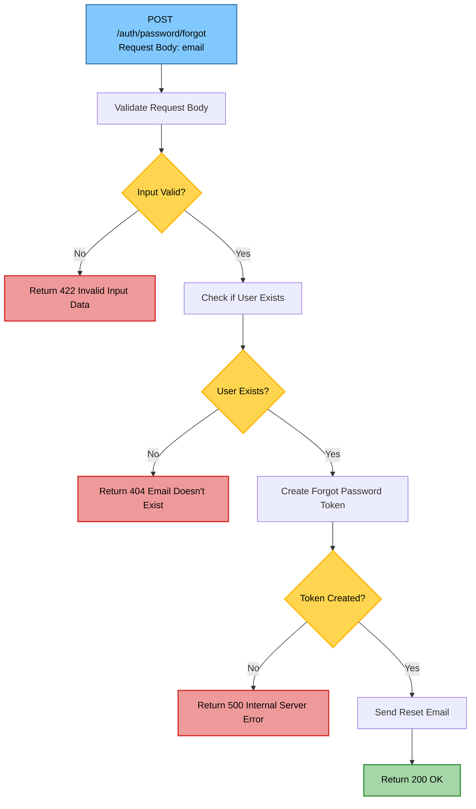
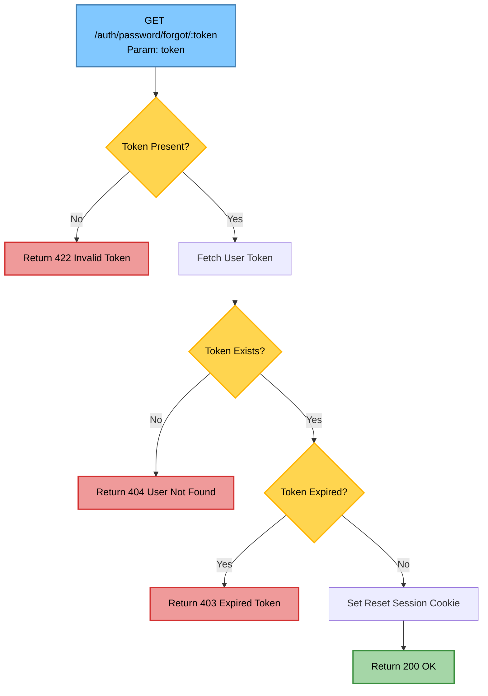
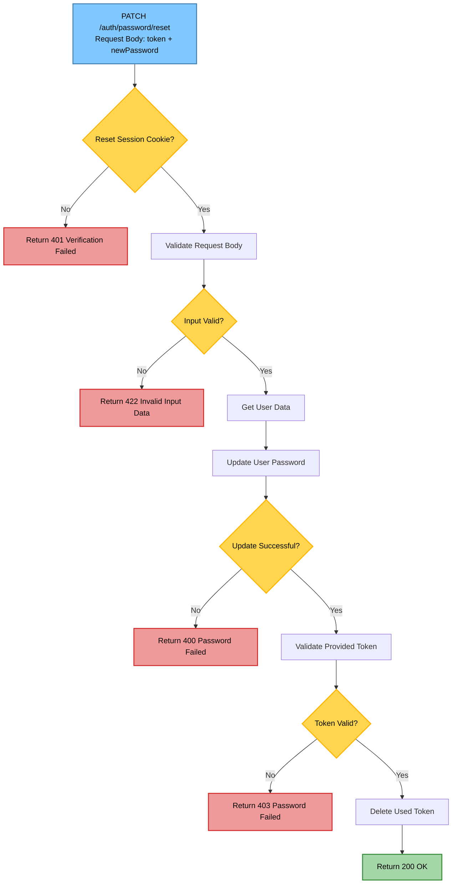
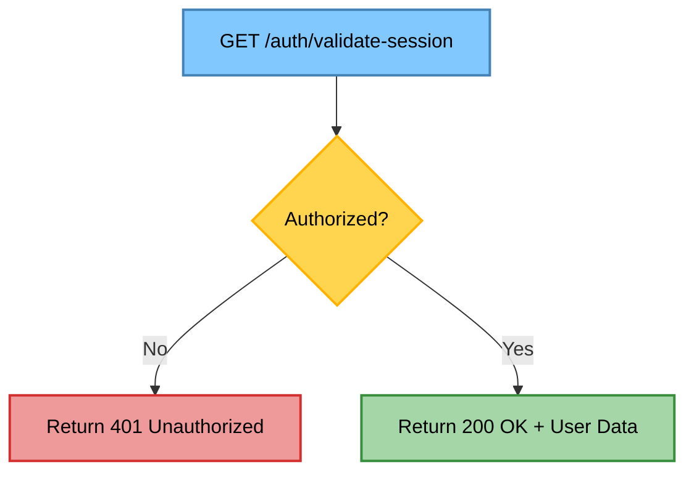

POST /auth/signup - Register New User


POST /auth/signin - User Login


POST /auth/signout - User Logout


GET /auth/verify/:token - Email Verification


POST /auth/password/forgot - Initiate Password Reset


GET /auth/password/forgot/:token - Get Reset Session


PATCH /auth/password/reset - Reset Password



GET /auth/validate-session - Validate Session


```mermaid

```
