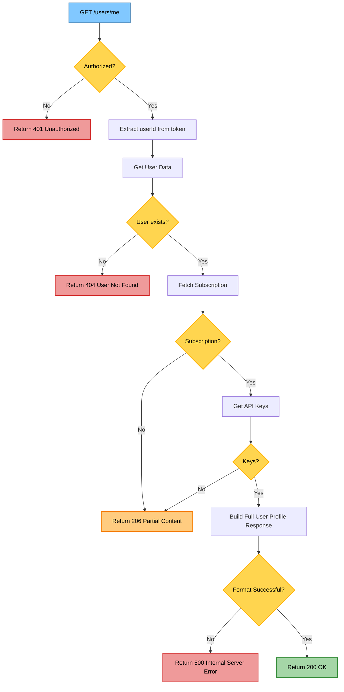
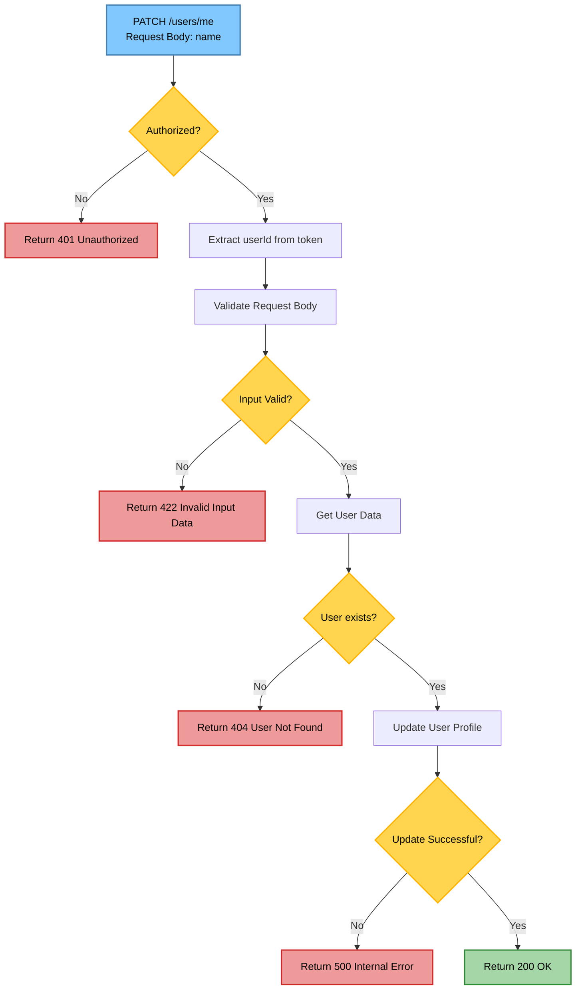
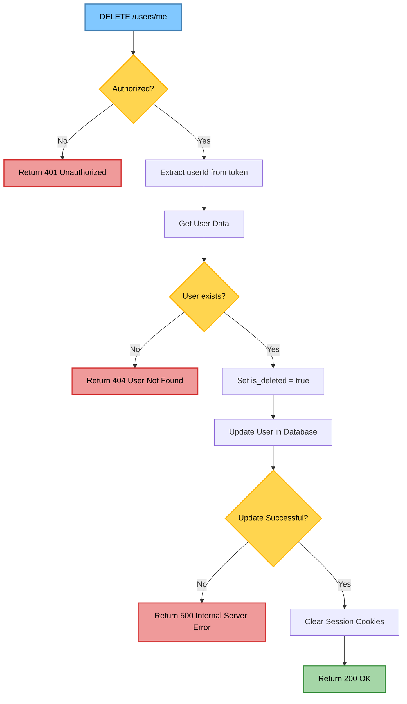
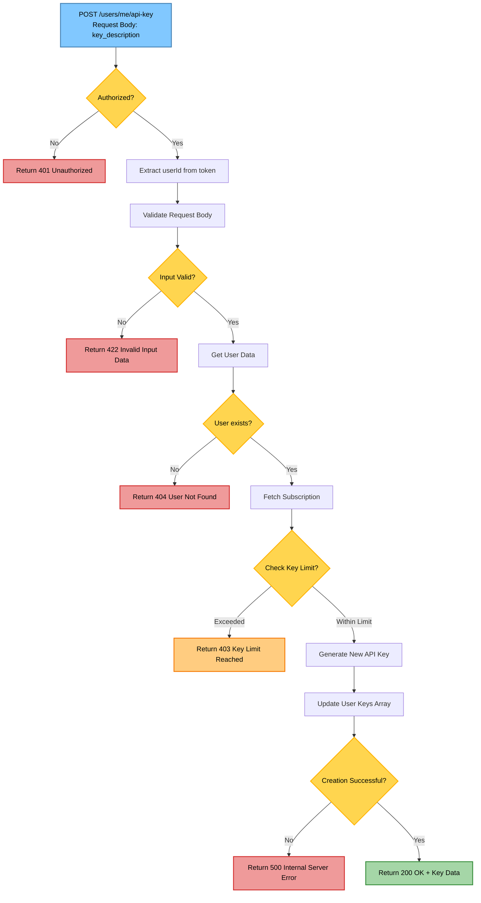
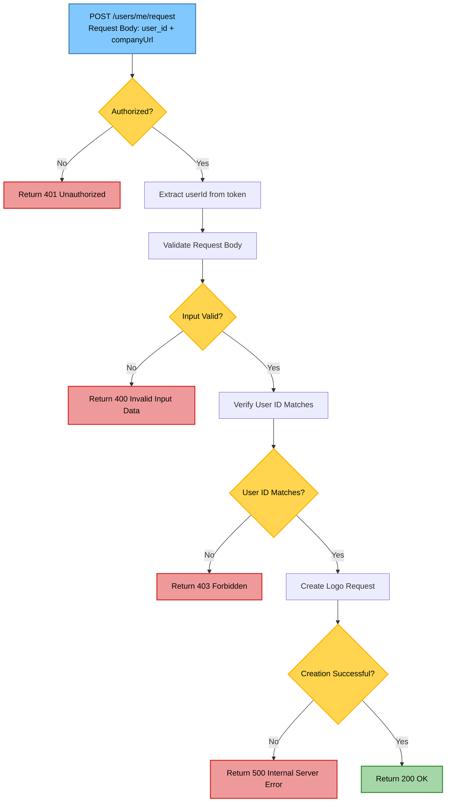

| URL | Method | Auth Required | Description |
|-----|--------|---------------|-------------|
| `/users/me` | GET | True | Retrieve authenticated user profile |

> <details>
> <summary>Response body</summary>
>
> ```json
> {
>    "statusCode": 200,
>    "data": {
>        "name": "ahrak nivah",
>        "email": "enyyvish@gmail.com",
>        "role": "CUSTOMER",
>        "is_verified": true,
>        "subscription_id": "6826d68a0fbea0d79998ef43",
>        "userId": "6826d68a0fbea0d79998ef45",
>        "created_at": "2025-05-16T06:09:14.000Z",
>        "is_deleted": false,
>        "updated_at": "2025-05-16T06:09:14.513Z",
>        "subscription": {
>            "_id": "6826d68a0fbea0d79998ef43",
>            "type": "HOBBY",
>            "key_limit": 2,
>            "usage_limit": 500,
>            "usage_count": 0,
>            "is_active": true,
>            "updated_at": "2025-05-16T06:09:14.288Z"
>        },
>        "keys": []
>    }
>}
> ```
> 
> **Response:** `200 OK` - User profile retrieved successfully</br>
> **Response:** `401 Unauthorized` - Not authenticated</br>
> **Response:** `404 Not Found` - User not found
> </details>

### Api Flow diagram



---
| URL | Method | Auth Required | Description |
|-----|--------|---------------|-------------|
| `/users/me` | PATCH | True | Update user profile details |

> <details>
> <summary>Request body</summary>
>
> ```json
>  {
>    "name": "local lamma"
>  }
>
> ```
> </details>
>
> <details>
> <summary>Response body</summary>
>
> ```json
> {
>   "statusCode" : 200
> }
> ```
> 
> **Response:** `200 OK` - Profile updated successfully</br>
> **Response:** `400 Bad Request` - Invalid input data</br>
> **Response:** `401 Unauthorized` - Not authenticated
> </details>

### Api Flow diagram


---
| URL | Method | Auth Required | Description |
|-----|--------|---------------|-------------|
| `/users/me` | DELETE | True | Permanently delete the user account |

> <details>
> <summary>Response body</summary>
>
> ```json
> {
>   "statusCode": 200
> }
> ```
> 
> **Response:** `200 OK` - Account deleted successfully</br>
> **Response:** `401 Unauthorized` - Not authenticated</br>
> **Response:** `404 Not Found` - User not found
> </details>

### Api Flow diagram

---
| URL | Method | Auth Required | Description |
|-----|--------|---------------|-------------|
| `/users/me/api-key` | POST | True | Generate a new API key |

> <details>
> <summary>Request body</summary>
>
> ```json
> {
>   "key_description": "sample key"
> }
> ```
> </details>
>
> <details>
> <summary>Response body</summary>
>
> ```json
> {
>    "statusCode": 200,
>    "data": {
>        "key_description": "sample key",
>        "subscription_id": "6826d68a0fbea0d79998ef43",
>        "_id": "684d52e03469f433197aa44a",
>        "api_key": "10E38C50555040A2A0220B6DB0AFDAE4",
>        "updated_at": "2025-06-14T10:45:52.395Z",
>        "__v": 0
>    }
> }
> ```
> 
> **Response:** `200 OK` - API key generated successfully</br>
> **Response:** `400 Bad Request` - Invalid input data</br>
> **Response:** `401 Unauthorized` - Not authenticated</br>
> **Response:** `403 Forbidden` - Key limit reached
> </details>

### Api Flow diagram

---
| URL | Method | Auth Required | Description |
|-----|--------|---------------|-------------|
| `/users/me/api-key/:keyId` | DELETE | True | Revoke an API key |

> <details>
> <summary>Response body</summary>
>
> ```json
> {
>   "statusCode":200
> }
> ```
> 
> **Response:** `200 OK` - API key revoked successfully</br>
> **Response:** `401 Unauthorized` - Not authenticated</br>
> **Response:** `404 Not Found` - API key not found
> </details>

### Api Flow diagram
 ```mermaid
flowchart TD
%% API Flow: DELETE /users/me/api-key/:keyId
Start[DELETE /users/me/api-key/:keyId<br/>Param: keyId] --> Auth{Authorized?}

Auth -->|No| Auth401[Return 401 Unauthorized]
Auth -->|Yes| ExtractUserId[Extract userId from token]

ExtractUserId --> ExtractKeyId[Extract keyId from params]
ExtractKeyId --> GetKey[Get API Key Data]

GetKey --> KeyExists{Key exists?}
KeyExists -->|No| Key404[Return 404 API Key Not Found]
KeyExists -->|Yes| CheckOwnership{User Owns Key?}

CheckOwnership -->|No| Key404
CheckOwnership -->|Yes| DeleteKey[Delete API Key]

DeleteKey --> UpdateUser[Remove from User Keys Array]
UpdateUser --> DeleteSuccess{Deletion Successful?}

DeleteSuccess -->|No| Server500[Return 500 Internal Server Error]
DeleteSuccess -->|Yes| Success200[Return 200 OK]

classDef startEnd fill:#81C8FF,stroke:#4682B4,stroke-width:2px,color:#000;
classDef decision fill:#FFD54F,stroke:#FFB300,stroke-width:2px,color:#000;
classDef success fill:#A5D6A7,stroke:#388E3C,stroke-width:2px,color:#000;
classDef error fill:#EF9A9A,stroke:#D32F2F,stroke-width:2px,color:#000;
classDef warning fill:#FFCC80,stroke:#F57C00,stroke-width:2px,color:#000;

class Start,Success200 startEnd
class Auth,KeyExists,CheckOwnership,DeleteSuccess decision
class Success200 success
class Auth401,Key404,Server500 error

```
---
| URL | Method | Auth Required | Description |
|-----|--------|---------------|-------------|
| `/users/me/password` | PUT | True | Update user password |

> <details>
> <summary>Request body</summary>
>
> ```json
> {
>   "currPassword": "oldPassword123",
>   "newPassword": "newPassword123"
> }
> ```
> </details>
>
> <details>
> <summary>Response body</summary>
>
> ```json
> {
>   "statusCode": 200
> }
> ```
> 
> **Response:** `200 OK` - Password updated successfully</br>
> **Response:** `400 Bad Request` - Invalid input data</br>
> **Response:** `401 Unauthorized` - Not authenticated or invalid current password
> </details>
> <details>

### Api Flow diagram
 ```mermaid
flowchart TD
%% API Flow: PUT /users/me/password
Start[PUT /users/me/password<br/>Request Body: currPassword + newPassword] --> Auth{Authorized?}

Auth -->|No| Auth401[Return 401 Unauthorized]
Auth -->|Yes| ExtractUserId[Extract userId from token]

ExtractUserId --> ValidateInput[Validate Request Body]
ValidateInput --> InputValid{Input Valid?}

InputValid -->|No| Input422[Return 422 Invalid Input Data]
InputValid -->|Yes| GetUser[Get User Data]

GetUser --> UserExists{User exists?}
UserExists -->|No| User404[Return 404 User Not Found]
UserExists -->|Yes| VerifyPassword[Verify Current Password]

VerifyPassword --> PasswordMatch{Password Matches?}
PasswordMatch -->|No| Password400[Return 400 Incorrect Password]
PasswordMatch -->|Yes| HashNewPassword[Hash New Password]

HashNewPassword --> UpdateUser[Update User Password]
UpdateUser --> UpdateSuccess{Update Successful?}

UpdateSuccess -->|No| Server500[Return 500 Internal Server Error]
UpdateSuccess -->|Yes| Success200[Return 200 OK]

classDef startEnd fill:#81C8FF,stroke:#4682B4,stroke-width:2px,color:#000;
classDef decision fill:#FFD54F,stroke:#FFB300,stroke-width:2px,color:#000;
classDef success fill:#A5D6A7,stroke:#388E3C,stroke-width:2px,color:#000;
classDef error fill:#EF9A9A,stroke:#D32F2F,stroke-width:2px,color:#000;
classDef warning fill:#FFCC80,stroke:#F57C00,stroke-width:2px,color:#000;

class Start,Success200 startEnd
class Auth,InputValid,UserExists,PasswordMatch,UpdateSuccess decision
class Success200 success
class Auth401,Input422,User404,Password400,Server500 error

```
---
| URL | Method | Auth Required | Description |
|-----|--------|---------------|-------------|
| `/users/me/request` | POST | True | Raise logo Request |

> <details>
> <summary>Request body</summary>
>
> ```json
> {
>   "user_id": "6826d68a0fbea0d79998ef45",
>   "companyUrl": "https://company.com"
> }
> ```
> </details>
>
> <details>
> <summary>Response body</summary>
>
> ```json
> {
>   "statusCode": 200
> }
> ```
> 
> **Response:** `200 OK` - Logo request submitted successfully</br>
> **Response:** `400 Bad Request` - Invalid input data</br>
> **Response:** `401 Unauthorized` - Not authenticated
> </details>

### Api Flow diagram



